# 🛡️ Incident Response Report: DC-1 (Drupalgeddon2)

## 1. Executive Summary
- **Target:** DC-1 (Vulnerable Web Server - IP: `192.168.80.100`).
- **Vulnerability:** Drupal 7.x Remote Code Execution (CVE-2018-7600 / Drupalgeddon2).
- **Impact:** System Compromised, Root access gained, Web Defacement, Sensitive Data Exfiltration (`/etc/shadow`).
- **Defense Stack:** Security Onion (SIEM Gateway), Wazuh (HIDS), `iptables` (Network Firewall).
- **Resolution:** Isolated the host via Gateway Firewall (Zero Trust approach), eradicated all backdoors, safely patched the CMS via an internal staging server, and reset enterprise credentials before restoring services.

---

## 2. Architecture & Environment
The lab environment is built on an **In-the-middle Traffic Analysis** architecture. Security Onion acts as the routing Gateway, allowing the Blue Team to monitor all network traffic and enforce Containment measures at the network level without interacting directly with the compromised host.

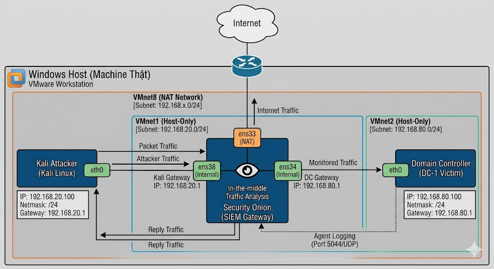

The Wazuh Agent was successfully deployed on the DC-1 machine and actively forwarded logs to the SIEM (Security Onion).

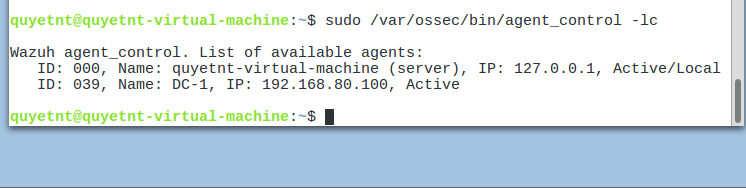
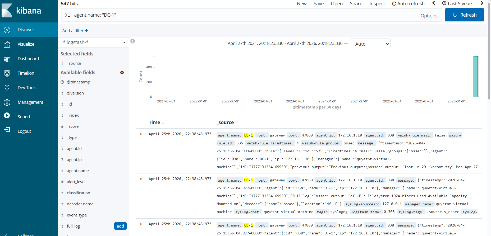

---

## 3. MITRE ATT&CK Mapping

| Tactic | Technique | ID | Description |
| :--- | :--- | :--- | :--- |
| **Initial Access** | Exploit Public-Facing App | `T1190` | Exploited Drupal RCE vulnerability (CVE-2018-7600). |
| **Execution** | Command and Scripting Interpreter | `T1059` | Established a Reverse Shell using Metasploit. |
| **Privilege Escalation**| Abuse Elevation Control Mechanism | `T1548.001`| Abused SUID misconfiguration on the `find` binary to gain Root privileges. |
| **Defense Evasion** | Indicator Removal on Host | `T1070.001`| Anti-Forensics: Overwrote `/var/log/auth.log` to 0 bytes. |
| **Credential Access** | OS Credential Dumping | `T1003.008`| Exfiltrated the `/etc/shadow` password hash file. |
| **Impact** | Defacement | `T1491.001`| Modified the `index.php` homepage to display a defacement flag. |

---

## 4. Phase 1: Attack & Detection

### 4.1. Reconnaissance
The attacker initiated a deep Nmap scan (`-sV -A`) to discover open ports and running services.

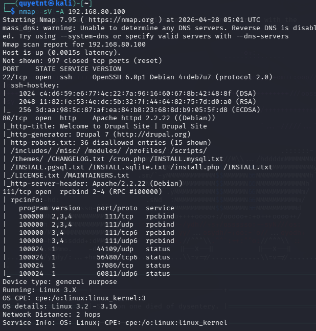

**SOC Detection:** The Wazuh Agent detected abnormal connection spikes, and Kibana successfully flagged the Nmap User-Agent.

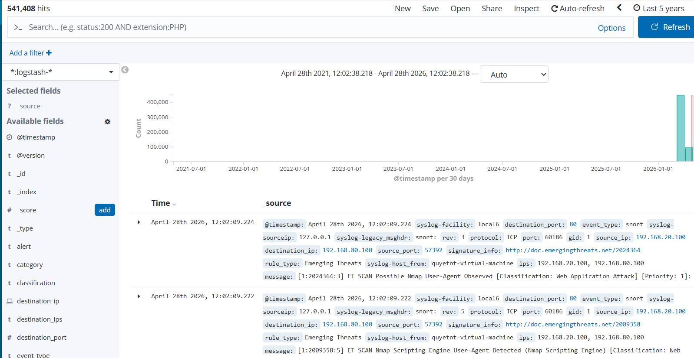

### 4.2. Exploitation & Establishing C2
The attacker utilized the `exploit/unix/webapp/drupal_drupalgeddon2` module in Metasploit to compromise the server.

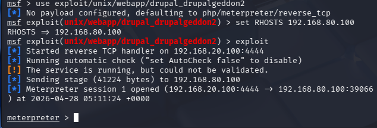

**SOC Detection:** Kibana logs revealed the DC-1 machine actively initiating a reverse connection (Reverse Shell) back to the attacker's IP on port 4444.

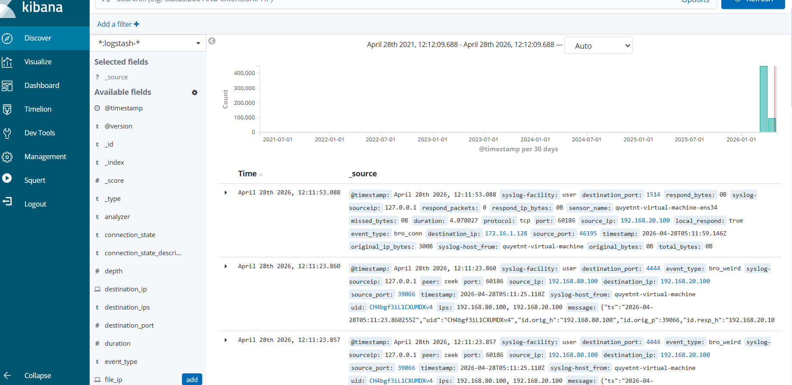

### 4.3. Privilege Escalation & Defacement
The attacker escalated privileges to root via the SUID vulnerability in the `find` command and subsequently defaced the website.

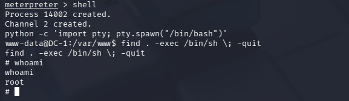
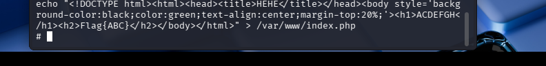
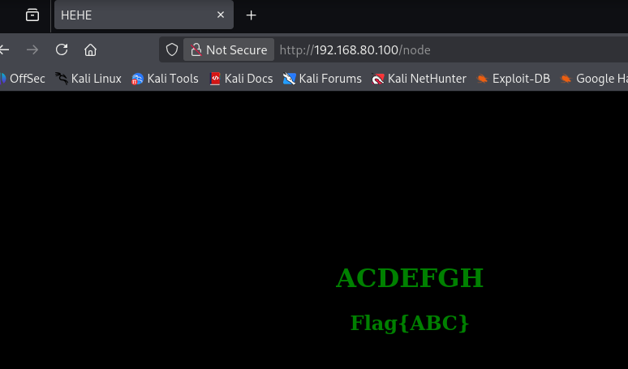

### 4.4. Defense Evasion (Anti-Forensics) & Backdoors
To cover their tracks, the attacker cleared the `/var/log/auth.log` file and created hidden rogue users (`hacker_lord`, `sys_update`) with root privileges (UID=0).

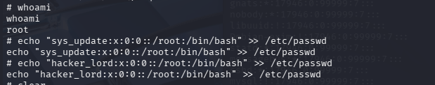
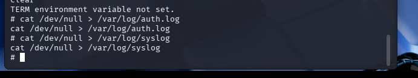

**SOC Detection:** Squert immediately triggered two High-Priority alerts: a massive reduction in log file size and a CIS Benchmark violation (Detection of unauthorized UID 0 accounts).

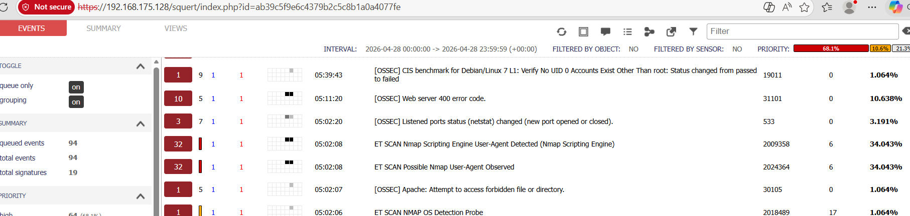
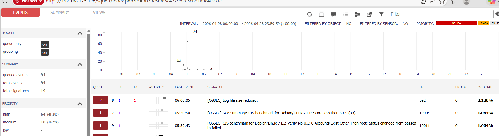

### 4.5. Data Exfiltration
The attacker prepared the sensitive `/etc/shadow` file by copying it into the web-accessible directory and modifying permissions.

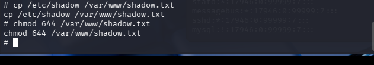

Subsequently, the file was exfiltrated to the Kali machine using `wget`.

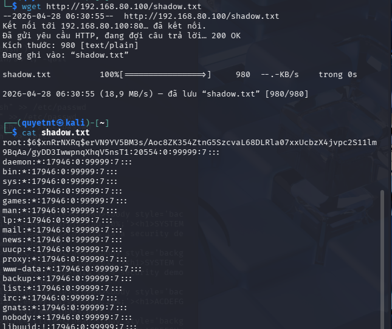

**SOC Detection:** The SIEM successfully detected the unique signature of the shadow file being transferred over unencrypted HTTP protocol.

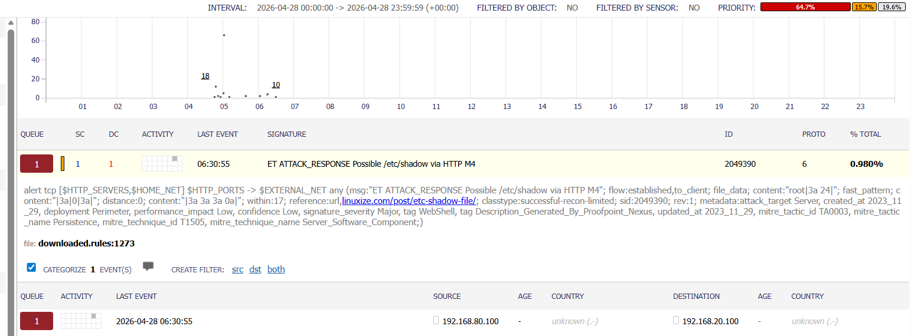

---

## 5. Phase 2: Containment

Since the system was fully compromised (Root access), the IR Team strictly followed the **Zero Trust** principle. No actions were performed directly on the DC-1 OS initially to avoid triggering potential booby traps and to preserve RAM/Disk states for forensics. All containment actions were executed Out-of-Band via the SIEM Gateway.

### 5.1. Attacker IP Blocking (Active Response)
A command was pushed from Security Onion to the local Agent to block the attacker's IP.

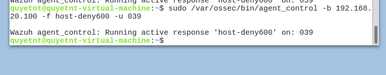

### 5.2. Total Host Quarantine (Network Isolation)
Leveraging the Gateway architecture, the IR team configured `iptables` rules to DROP all inbound and outbound traffic for DC-1.

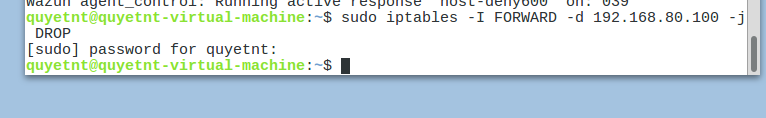
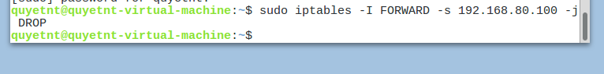

---

## 6. Phase 3: Eradication
After securing a snapshot of the machine, the IR team accessed the internal console of DC-1 to manually clean the malware and backdoors.

*   **Removing Malicious Files:** Deleted the defaced `index.php` and the leaked `shadow.txt`.
    *   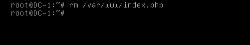
    *   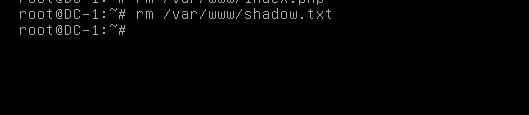
*   **Stripping SUID Permissions:**
    *   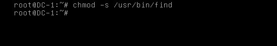
*   **Removing Rogue Users:** Encountered an OS self-defense mechanism (Process 1 error) when attempting to use `userdel`. The team manually cleaned the `/etc/passwd` file and rebooted the system.
    *   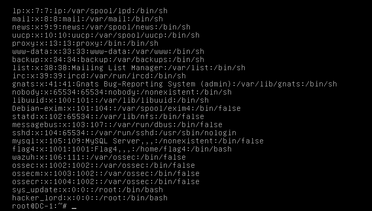
    *   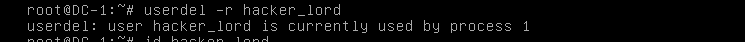
    *   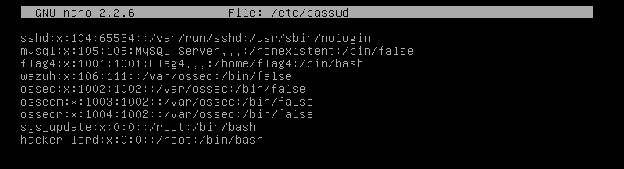
    *   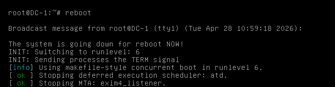

---

## 7. Phase 4: Recovery Plan

During this phase, the IR Team executed an "Air-gapped Patching" procedure to ensure the host was completely secure before reconnecting it to the network.

| Step | Action | Technical Details | Evidence |
| :---: | :--- | :--- | :--- |
| **1** | **Prepare Patch** | Downloaded the CMS update and set up an internal Staging Server on Security Onion. | 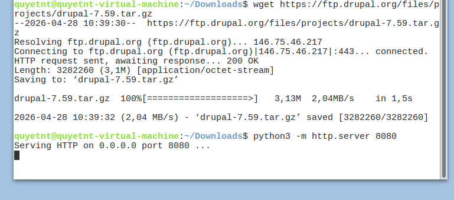 |
| **2** | **Pull Patch Internally** | DC-1 fetched the patch from the Staging Server via the internal network. | 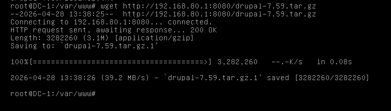 |
| **3** | **Extract Patch** | Extracted the updated source code locally. | 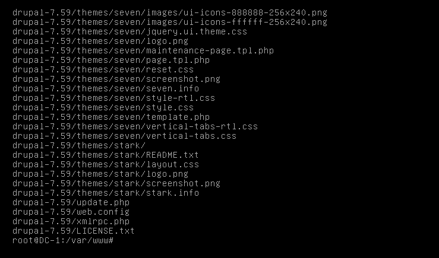 |
| **4** | **Restore Service** | Overwrote the web directory with the clean source code and restarted Apache2. | 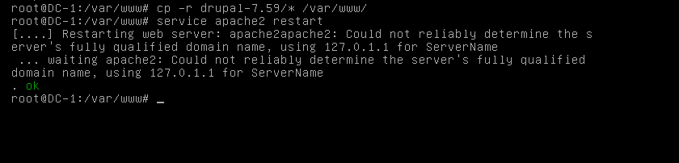 |
| **5** | **Reset Credentials** | Reset the Root password immediately to invalidate the stolen hashes. | 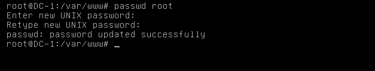 |
| **6** | **Network Unblocking** | Removed the `DROP` rules on the Gateway `iptables` to restore external access. | 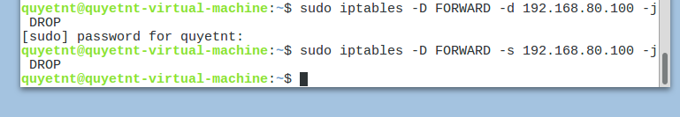 |
| **7** | **Verification** | Verified that the website was functioning properly from an external network. | 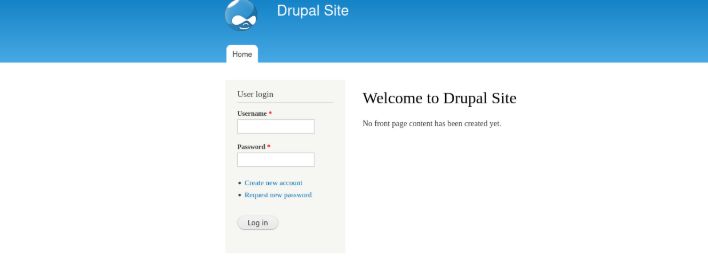 |
| **8** | **Hyper-Care Monitoring** | Created a dedicated Kibana Dashboard to closely monitor DC-1 post-incident. | 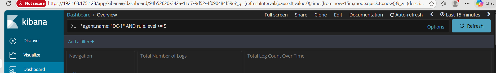 |
